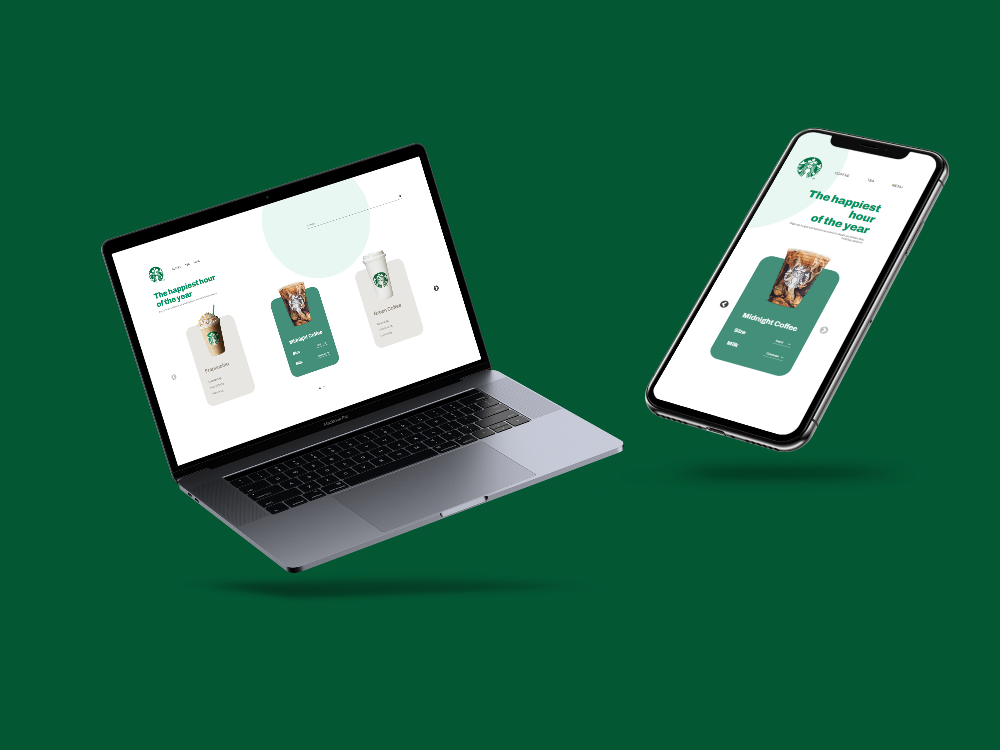

# Vuebucks :coffee:	

<h3>Projeto em Vue :rocket:	</h3>

Vuebucks é um projeto com intuito de montar uma vitrine virtual clone do Starbucks.

O projeto tem um design simples e moderno além de ser totalmente responsivo.

<a href="https://vuebucks.vercel.app/">Acesse o site!</a>
 

### 🛠 Tecnologias

As seguintes ferramentas foram usadas na construção do projeto:

- [Vue](https://vuejs.org/)
- [Vue-Slick](https://github.com/staskjs/vue-slick)
 

### Features

- [x] Slider
- [x] Modais
- [x] Produtos

 

### Autor
---

 
  
 <b>Leonardo Nicola</b></a> 🚀

Feito com ❤️ por Leonardo Nicola 👋🏽 Entre em contato!

 

